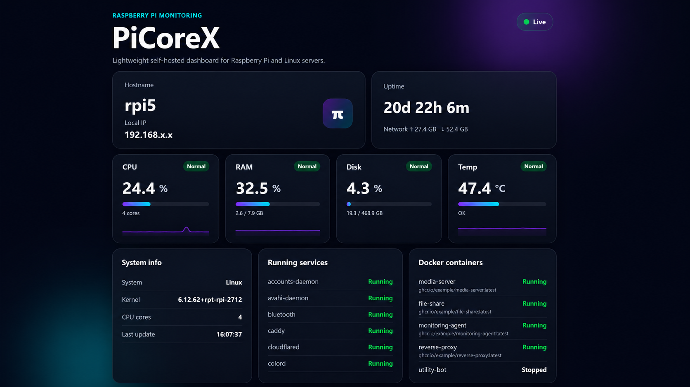

# PiCoreX

A lightweight self-hosted dashboard for Raspberry Pi and Linux servers.

PiCoreX shows live system information directly from your device through a clean web dashboard.

## Features

- CPU usage
- RAM usage
- Disk usage
- CPU temperature
- Uptime
- Hostname and local IP
- Running system services
- Docker containers status
- Network usage
- Responsive dark UI

## Installation

```bash
git clone https://github.com/xbigi/PiCoreX.git
cd PiCoreX
chmod +x install.sh run.sh
./install.sh
./run.sh
## Preview


